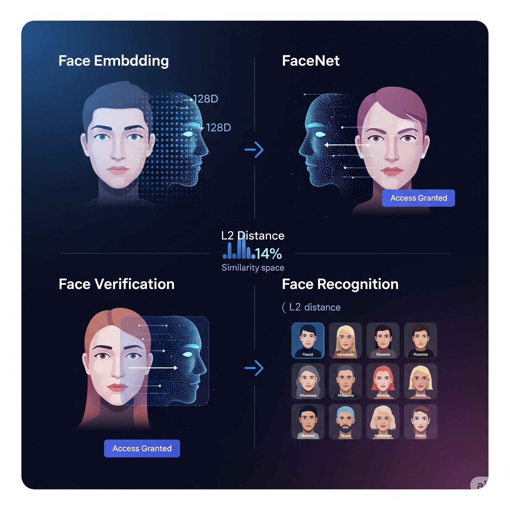

# Face Recognition with FaceNet

<p align="center">
  
</p>

This project demonstrates a face recognition and verification system using a **pretrained FaceNet model**. It compares faces based on their embeddings - 128D numerical vectors - that capture unique features of each face.

---

## What This Project Does

**Face Verification**  
Checks if a person in an image matches a claimed identity. Example use case: secure door access.

**Face Recognition**  
Identifies a person by comparing their face to a database of known faces and finding the closest match.

**L2 Distance Based Comparison**  
The system uses Euclidean (L2) distance to measure similarity between face embeddings.

---

## Project Structure
```bash
facenet-face-recognition/
│
├── images/ # Folder with known face images
├── keras-facenet-h5/
└── notebook.ipynb
```
---


---

## Features

- Face verification with a distance threshold
- Identify unknown faces from a known database
- L2-normalized embeddings for consistent comparison

---

## 👨‍💻 Author

**Nabeel Shan**  
Software Engineering Student - NUST Islamabad  
Aspiring AI Researcher | AI/ML Enthusiast  
[LinkedIn](https://www.linkedin.com/in/nabeelshan) • [GitHub](https://github.com/nabeelshan78)  
- Currently focused on mastering CNNs, YOLO, and ResNet architectures.
- Mastering Deep Learning architectures through hands-on work
- Looking to collaborate on AI/ML projects or research opportunities

---
