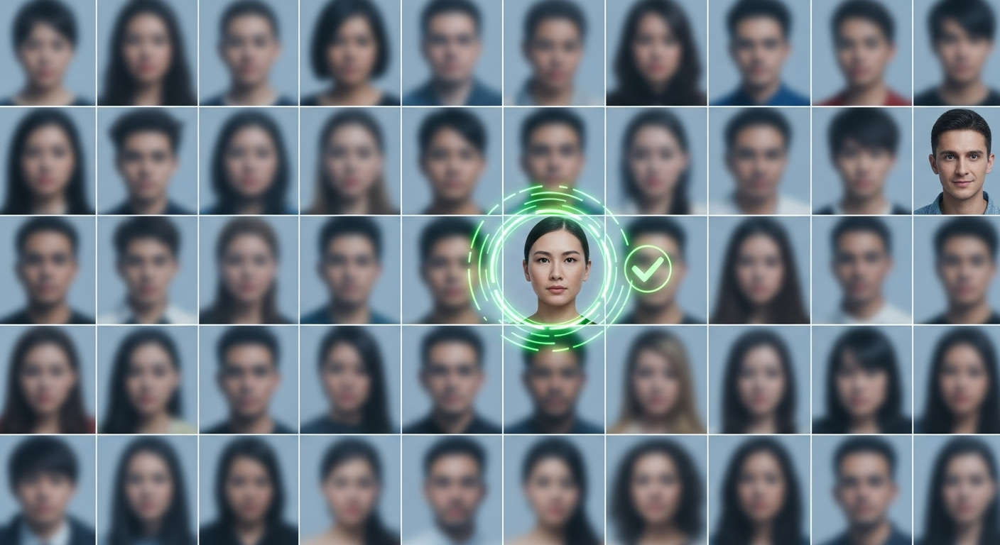
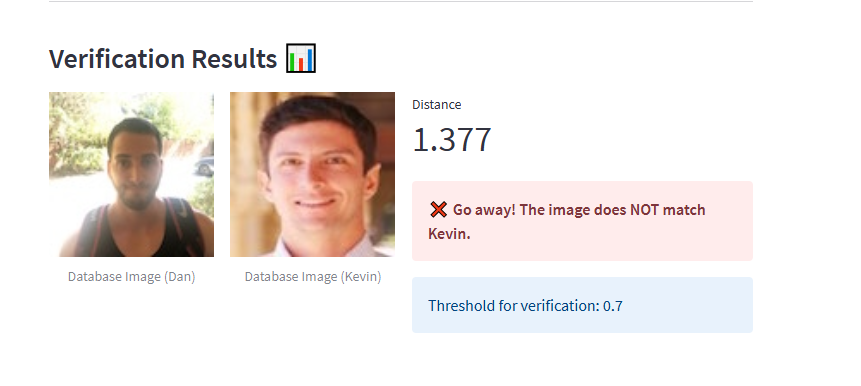
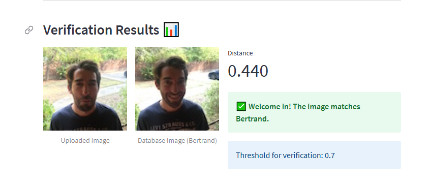
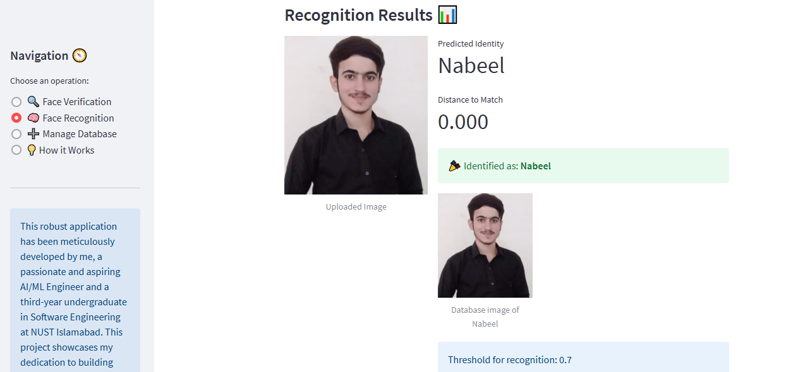

# 👁️‍🗨️ FaceNet-Powered Face Recognition & Verification App

---

## ✨ Unlock the Power of Face Recognition with Streamlit and FaceNet!

This project presents a robust and user-friendly web application for real-time face recognition and verification, built using **Streamlit** and a pre-trained **FaceNet** model. Whether you need to verify an identity or identify an unknown face from a database, this app provides an intuitive and efficient solution.



---

## 🌟 Features

* ### Face Verification (1:1 Matching):
    * Verify if a person in an uploaded image matches a specific claimed identity from your database.
    * Provides a clear "**Welcome In**" (✅) or "**Go Away**" (❌) result based on similarity.

* ### Face Recognition (1:Many Identification):
    * Identify an unknown face by comparing it against all known faces in your database.
    * Predicts the closest matching identity and the confidence score (**distance**).

* ### Interactive Web Application:
    * Built with **Streamlit** for a beautiful, responsive, and interactive user interface.
    * Easy navigation between different functionalities via a sidebar.

* ### Flexible Image Input:
    * Seamlessly upload new images via a drag-and-drop interface.
    * Option to select existing images directly from the database for testing or demonstration.

* ### Dynamic Database Management:
    * Add new individuals to your database by providing a name and uploading their image.
    * View all existing database entries at a glance in a visually organized gallery.

* ### Performance Optimized:
    * Leverages Streamlit's caching mechanisms (`st.cache_resource`, `st.cache_data`) to load the FaceNet model and pre-compute embeddings only once, ensuring fast subsequent operations.

* ### Clear & Intuitive UI:
    * Utilizes Streamlit's column layout, headers, subheaders, and emojis for an enhanced user experience.
    * Results are displayed clearly with distances and color-coded messages.

---

## 🚀 Getting Started

Follow these steps to get your Face Recognition & Verification app up and running locally.

---

### 🧰 Prerequisites

Before you begin, ensure you have the following installed:

* **Python 3.7+**
* **pip** (Python package installer)

---

### 🛠️ Installation

1.  **Clone the repository:**

    ```bash
    git clone [https://github.com/your-username/facenet-face-recognition.git](https://github.com/your-username/facenet-face-recognition.git)
    cd facenet-face-recognition
    ```

2.  **Create a virtual environment (recommended):**

    ```bash
    python -m venv venv
    # On Windows:
    .\venv\Scripts\activate
    # On macOS/Linux:
    source venv/bin/activate
    ```

3.  **Install the required Python packages:**

    ```bash
    pip install -r requirements.txt
    ```

### Download FaceNet Model Weights

The pre-trained FaceNet model weights (`model.h5` and `model.json`) are crucial. Ensure they are placed in the `keras-facenet-h5/` directory. If they are not already present, you might need to download them from a source similar to pre-trained model repositories.

> Place `model.json` and `model.h5` inside the `keras-facenet-h5/` directory.

---

### Prepare Database Images

Place your initial set of known face images (e.g., `danielle.png`, `younes.jpg`, etc.) into the `images/` directory. These images will be automatically loaded into the database when the application starts.

---

### Running the Application

Once the setup is complete, you can launch the Streamlit application:

```bash
streamlit run app.py
```

This command will open the application in your default web browser (usually at http://localhost:8501).

---

## 📁 Project Structure
The repository is organized as follows:
```
facenet-face-recognition/
├── .gitattributes
├── app.py                      # Main Streamlit application script
├── face.png                    # Project banner image
├── nn_model.png                # Another potential banner/diagram image
├── notebook.ipynb              # Jupyter notebook for model exploration/testing
├── images/                     # Directory for database images and demo screenshots
│   ├── andrew.jpg
│   ├── arnaud.jpg
│   ├── benoit.jpg
│   ├── bertrand.jpg
│   ├── camera_0_younes.jpg     # Example test images
│   ├── ... (other database images)
│   └── younes.jpg
└── keras-facenet-h5/           # Directory for the pre-trained FaceNet model
    ├── model.h5                # Pre-trained FaceNet model weights
    └── model.json              # FaceNet model architecture definition
```

---


## 🧪 Demo Examples

Here are some screenshots showcasing the application's interface and functionalities:

### Face Verification in Action


_Verify if an uploaded image matches a claimed identity from the database._

### Face Recognition in Action

_Identify an unknown person from your database._

---

## 💡 How It Works

This application leverages the power of FaceNet, a deep convolutional neural network, to perform highly accurate face recognition and verification.

### Face Detection (Implicit in Preprocessing):
Before processing, the input images are assumed to contain a single, pre-aligned face. In a full production system, an additional step using a face detector like MTCNN (Multi-task Cascaded Convolutional Networks) would be used to find and crop faces from raw images.

### Face Embeddings:
The core idea behind FaceNet is to transform each face into a compact, numerical representation called a **face embedding**. This embedding is a 128-dimensional vector (a list of 128 numbers) that captures the unique characteristics of a person's face.

* Faces belonging to the same person will have embeddings that are very "close" to each other in this 128-dimensional space.
* Faces belonging to different people will have embeddings that are "far apart."

### Triplet Loss (for Training FaceNet):
FaceNet is typically trained using a **Triplet Loss** function. This loss function encourages:

* An **anchor** image's embedding ($A$) to be closer to a **positive** image's embedding ($P$) (same person) than to a **negative** image's embedding ($N$) (different person).
* Specifically, it aims to satisfy: $||A-P||_2^2 + \alpha < ||A-N||_2^2$, where $\alpha$ is a margin. This ensures a clear separation between same-person and different-person embeddings.

### Similarity Search (Euclidean Distance):
Once we have embeddings, comparing faces becomes a simple geometric problem. We use **Euclidean Distance** to measure the "distance" between two embedding vectors.

* The smaller the distance, the more similar the faces are.
* A predefined **threshold** (e.g., 0.7 in this application) is used to determine if two faces are considered a "match."

### Face Verification vs. Face Recognition:
* **Verification (1:1):** You provide a test image and a claimed identity. The system calculates the distance between the test image's embedding and the claimed identity's stored embedding. If the distance is below the threshold, the identity is verified.
* **Recognition (1:Many):** You provide a test image, and the system compares its embedding to every embedding in the database. It finds the database entry with the smallest distance. If this minimum distance is below the threshold, the person is identified; otherwise, they are marked as "Not in database."

---

## 💾 Manage Face Database

The "Manage Database" section allows you to interact with the collection of known faces:

* **Add New Person:** Upload an image of a new individual and assign them a name. Their face embedding will be computed and added to the in-memory database.
* **Current Database Entries:** Browse a gallery of all faces currently stored in the database, including their names. This provides a quick visual overview of your known individuals.

---

## 🔧 Customization Tips

* **Adding More Faces:** Use the "Manage Database" section to easily expand your collection of known individuals.
* **Adjusting Threshold:** The 0.7 threshold for verification and recognition can be adjusted in the `verify()` and `who_is_it()` functions within `app.py`. Experiment with this value to find the optimal balance between false positives and false negatives for your specific use case.
* **Persistent Database:** Currently, dynamically added faces are stored in Streamlit's session state and will be lost upon app restart. For a persistent database, consider integrating with:
    * A local file system (saving embeddings/images to disk).
    * A simple database (e.g., SQLite, TinyDB).
    * A cloud database (e.g., Firebase Firestore, AWS S3 + DynamoDB).
* **Face Detection Preprocessing:** For real-world scenarios with uncropped images, integrate a robust face detection step (e.g., MTCNN, Haar Cascades, or a more advanced YOLO/SSD-based detector) before feeding faces to FaceNet.
* **Model Fine-tuning:** For higher accuracy on specific datasets, consider fine-tuning the FaceNet model on your own collection of faces.

---

## 📈 Future Improvements

* **Real-time Video Stream:** Integrate webcam input for live face recognition/verification.
* **Batch Processing:** Allow uploading multiple images for recognition/verification at once.
* **User Authentication:** Implement a basic login system for managing database access.
* **Database Export/Import:** Features to export the current database and import a new one.
* **Dockerization:** Provide a Dockerfile for easy deployment and environment setup.
* **Performance Monitoring:** Add metrics to track inference time and accuracy.

---

## 🙌 Acknowledgments

This project stands on the shoulders of giants. Special thanks to:

* **FaceNet:** For the groundbreaking work on face embeddings and the pre-trained model.
* **TensorFlow & Keras:** The powerful deep learning framework used for model implementation.
* **Streamlit:** For making it incredibly easy to build beautiful and interactive web applications with Python.
* **PIL (Pillow):** For robust image processing capabilities.
* **NumPy:** For efficient numerical operations.

---

## 🧑‍💻 Developed By

This robust application has been meticulously developed by me, a passionate and aspiring AI/ML Engineer and a third-year undergraduate in Software Engineering at NUST Islamabad. This project showcases my dedication to building high-impact solutions and my commitment to advancing my skills in AI/ML. I am excited to continue contributing to the field through practical applications and research.
